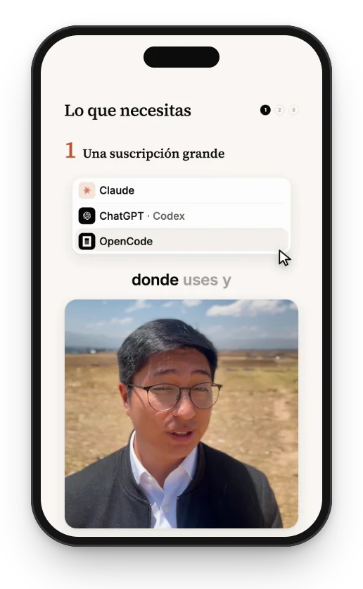
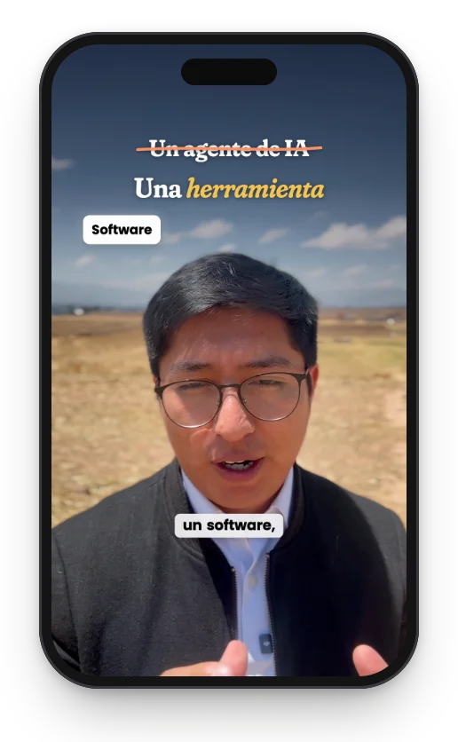
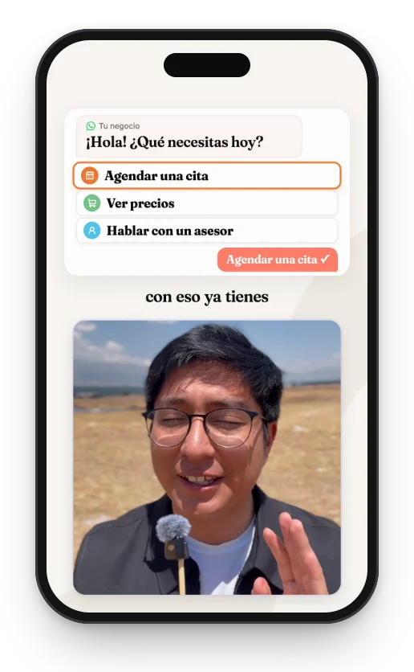
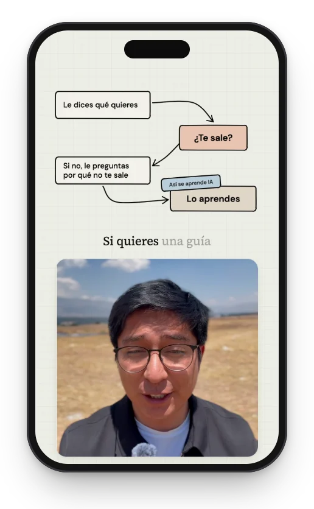
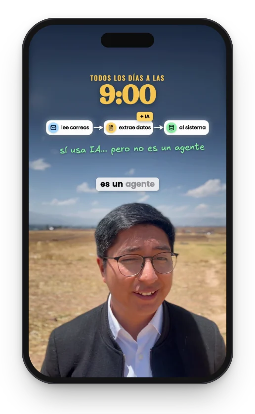
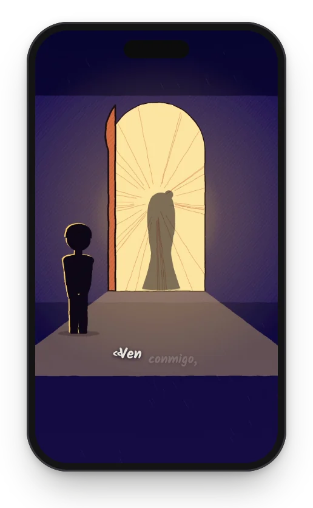
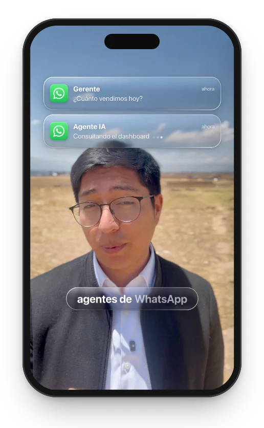
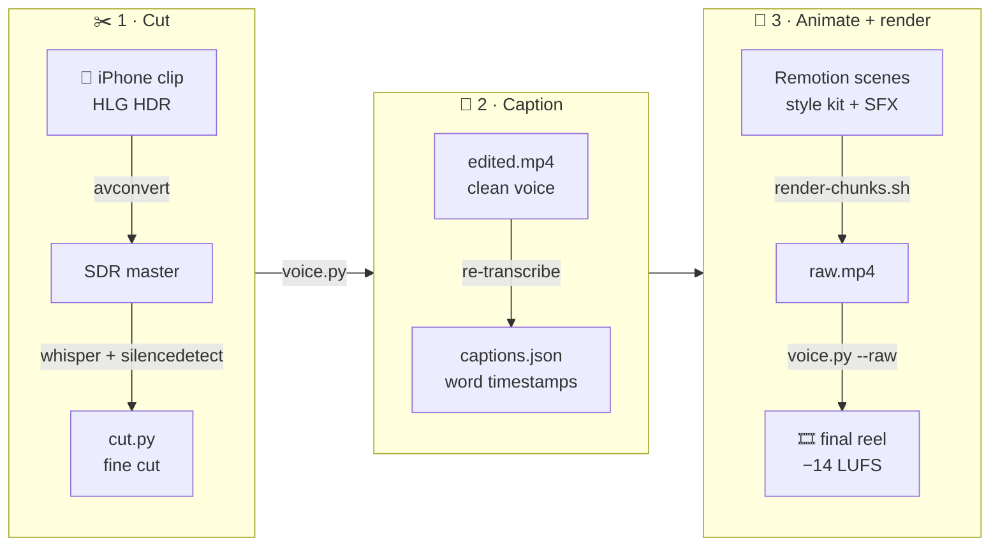

<div align="center">



# video-animacion-stiven

**Short-form video, edited like code.**<br>
Vertical reels cut, captioned and animated with Remotion, FFmpeg and Whisper, and directed with Claude Code.

<p>


</p>
<p>


</p>
<p>


</p>

[Styles](#-styles) · [Pipeline](#-pipeline) · [Quick start](#-quick-start) · [The skill](#-the-claude-code-skill) · [Reels](#-reels) · [Repo map](#-repo-map)

</div>

---

Every reel here is a program. A Python script cuts the silences and stumbles, Whisper times every word, and React components animate the explanation frame by frame. Nothing is keyframed by hand: fix a line of code and re-render only the 10-second chunk it touches.

The whole workflow ships as a **Claude Code skill**, so you describe the reel and the style, and Claude runs the pipeline with the same guardrails every time.

## 🎨 Styles

Seven visual languages, each built from real references (fonts, hex colors and positions measured from the source, never approximated).

<table>
<tr>
<td align="center" width="14%"></td>
<td align="center" width="14%"></td>
<td align="center" width="14%"></td>
<td align="center" width="14%"></td>
<td align="center" width="14%"></td>
<td align="center" width="14%"></td>
<td align="center" width="14%"></td>
</tr>
<tr>
<td valign="top">

**Claude-UI**<br>
<sub>Cream canvas, white cards, pastel menu tiles, a gliding hover and a big cursor, lifted from the real claude.ai interface. Full, card and voice-only modes.</sub><br><br>
<a href="skills/talking-head-reel/assets/styles/claude-ui"><code>styles/claude-ui</code></a>

</td>
<td valign="top">

**Ali Abdaal**<br>
<sub>Soft serif headlines that light up word by word, gold italic keywords, handwritten notes, logo stickers and a light caption chip.</sub><br><br>
<a href="skills/talking-head-reel/assets/styles/ali-abdaal"><code>styles/ali-abdaal</code></a>

</td>
<td valign="top">

**Ali YouTube** <sup>new</sup><br>
<sub>Ali's long-form graphics: cream canvas with a soft swoosh, a lilac-bordered camera card under a white panel, chapter cards, serif words that arrive blurred, and real screenshots with a source line.</sub><br><br>
<a href="skills/talking-head-reel/assets/styles/ali-youtube"><code>styles/ali-youtube</code></a>

</td>
<td valign="top">

**Claude Carousel**<br>
<sub>Claude's own Instagram language: grid paper, hand-drawn boxes with tilted tabs, curved arrows, clay tiles and metro lines, plus the reels' soft serif headlines and chalk icons drawn over the camera.</sub><br><br>
<a href="skills/talking-head-reel/assets/styles/claude-carousel"><code>styles/claude-carousel</code></a>

</td>
<td valign="top">

**Ali × Sketch**<br>
<sub>Ali's boxes, cards and glossy tiles, Excalidraw's hand strokes (rough.js + Excalifont), and a frameless camera drop that turns the sky into a stage for diagrams.</sub><br><br>
<a href="skills/talking-head-reel/assets/styles/ali-sketch"><code>styles/ali-sketch</code></a>

</td>
<td valign="top">

**Sketch**<br>
<sub>A hand-drawn "dirty line": line boil with a new seed every 2 frames, animation on twos, hatching, paper grain and silhouettes.</sub><br><br>
<a href="videos/2026-09-25-poema-milena/src/sketch.tsx"><code>poema-milena/sketch.tsx</code></a>

</td>
<td valign="top">

**Liquid Glass** <sup>experimental</sup><br>
<sub>Real refraction: an SDF displacement map feeds SVG filters through <code>backdrop-filter</code>, tuned to the macOS 27 glass.</sub><br><br>
<a href="skills/talking-head-reel/assets/styles/liquid-glass/glass-board.html"><code>styles/liquid-glass</code></a>

</td>
</tr>
</table>

<details>
<summary><b>Design tokens per style</b></summary>
<br>

| Style | Type | Palette |
|-------|------|---------|
| Claude-UI | Source Serif 4 · Inter · JetBrains Mono |        |
| Ali Abdaal | Fraunces SOFT 100 (for Recoleta) · Poppins · Gaegu · Oswald |        |
| Ali YouTube | Fraunces (opsz 72, SOFT 30) · Inter |         |
| Claude Carousel | Source Serif 4 · DM Sans · JetBrains Mono |        |
| Ali × Sketch | Fraunces SOFT 100 · Poppins · Excalifont · Oswald |        |
| Sketch | Kalam |        |
| Liquid Glass | SF Pro (system stack) |    |

</details>

## 🎬 Pipeline



Every stage stops for approval before the next one starts:

`style board` → `pieces preview` → `fine cut` → `audio A/B` → `mode map` → `final render`

## ⚡ Quick start

**Requirements:** Node.js (tested on 24), Python 3 with `numpy` + `scipy`, FFmpeg, [`whisper-cli`](https://github.com/ggml-org/whisper.cpp) with a `ggml-small.bin` model, and macOS (`avconvert` tonemaps iPhone HDR).

```bash
npm install
pip3 install numpy scipy
```

Open or render any reel by a fragment of its folder name:

```bash
npm run studio -- opus                          # Remotion Studio for videos/*opus*
npm run render -- opus OpusReel                 # full-quality render → out/raw.mp4
tools/render-chunks.sh mcp McpReel              # chunked render → out/raw.mp4
tools/render-chunks.sh mcp McpReel 10 49-53     # re-render only the chunks touching 49–53 s
```

<details>
<summary><b>Start a new talking-head reel by hand</b></summary>
<br>

```bash
M="path/to/ggml-small.bin"
V=videos/$(date +%F)-<slug>
mkdir -p $V/{public,work,out}
cp -R skills/talking-head-reel/assets/template/{src,scripts} $V/
cd $V/work
avconvert -s ~/Downloads/IMG_XXXX.mov -p Preset3840x2160 -o sdr.mov --replace
ffmpeg -i sdr.mov -ar 16000 -ac 1 audio.wav
whisper-cli -m "$M" -l es -ojf -of words audio.wav
python3 ../scripts/cut.py sdr.mov ../public/edited.mp4 /dev/null && cp cuts.json ../src/
ffmpeg -i ../public/edited.mp4 -ar 16000 -ac 1 edited.wav
whisper-cli -m "$M" -l es -ojf -of ewords edited.wav
python3 ../scripts/captions.py ewords.json ../src/captions.json
```

Then polish the voice with `scripts/voice.py`, build the scenes, render, run `voice.py --raw` on the final mix, and move the deliverable to `finals/`.

</details>

<details>
<summary><b>Render the narrated poem</b></summary>
<br>

```bash
P=videos/2026-09-25-poema-milena
python3 $P/scripts/sfx.py $P/timeline.json $P/work/sfx.wav
# mix voice + ducked SFX → $P/public/poema-mix.wav (see CLAUDE.md), then:
npm run render -- poema Poema
```

</details>

## 🧠 The Claude Code skill

[`skills/talking-head-reel`](skills/talking-head-reel) teaches Claude Code the entire workflow: how to cut, where captions may sit, which style kit to use, and when to stop and ask. Install it once:

```bash
ln -s "$PWD/skills/talking-head-reel" ~/.claude/skills/talking-head-reel
```

Then just talk to Claude Code:

```text
> Edit ~/Downloads/IMG_4390.mov into a reel, Ali Abdaal style
```

| Path | What it holds |
|------|---------------|
| [`SKILL.md`](skills/talking-head-reel/SKILL.md) | Activation contract, reference-fidelity rules, decision gates |
| [`references/pipeline.md`](skills/talking-head-reel/references/pipeline.md) | Commands, layout numbers, render benchmarks, gotchas |
| [`references/styles.md`](skills/talking-head-reel/references/styles.md) | How to study a reference, plus every style kit |
| [`assets/template/`](skills/talking-head-reel/assets/template) | A working Remotion project with `cut.py`, `captions.py`, `voice.py`, `sfx_samples.py` |
| [`assets/styles/`](skills/talking-head-reel/assets/styles) | Claude-UI, Claude Carousel, Ali Abdaal, Ali YouTube, Ali × Sketch and Liquid Glass kits with their HTML style boards |

**Guardrails it enforces**

| Rule | Value |
|------|-------|
| Safe area (IG / TikTok) | top 250 · bottom 1500 · right rail x > 940 |
| Caption lane in card mode | y 860–1010, nothing else may enter |
| Captions | re-transcribed from the **edited** audio, never remapped |
| Loudness | −14 LUFS, re-normalized after the SFX mix |
| Render | `--image-format=png --crf=14 --x264-preset=slow --color-space=bt709` |
| Last check | chin-band scan of the final at 1 fps |

## 📼 Reels

| Date | Reel | Composition | Style | fps |
|------|------|-------------|-------|-----|
| 2026-09-25 | [Jev explainer](videos/2026-09-25-jev-reel) | `JevExplainer` | Claude-UI cards, Jev / TypeSafe brand | 30 |
| 2026-09-25 | [Milena poem](videos/2026-09-25-poema-milena) | `Poema` | Sketch, narrated | 30 |
| 2026-09-26 | [Opus 5.5 workflow](videos/2026-09-26-opus-reel) | `OpusReel` | Claude-UI, full / card modes | 60 |
| 2026-09-26 | [AI-Native SDLC playbook](videos/2026-09-26-sdlc-playbook) | `SdlcReel` | Claude-UI, cited source figures | 60 |
| 2026-09-27 | [Agent workflows](videos/2026-09-27-workflows) | `WorkflowsReel` | Claude-UI kit, voice-only mode | 60 |
| 2026-09-27 | [MCP vs WhatsApp](videos/2026-09-27-mcp-vs-whatsapp) | `McpReel` | Ali Abdaal | 60 |
| 2026-09-28 | [Agents vs automations](videos/2026-09-28-fusion) | `FusionReel` | Ali × Sketch, two takes joined | 60 |
| 2026-10-07 | [Don't buy AI courses](videos/2026-10-07-cursos-ia) | `CursosReel` | Claude Carousel, CC0 stroke sounds | 60 |
| 2026-10-07 | [WhatsApp agents](videos/2026-10-07-whatsapp-agentes) | `WhatsAppReel` | Ali YouTube, four camera modes | 60 |
| 2026-10-08 | [Gentle AI + Engram](videos/2026-10-08-gentle-ai) | `GentleReel` | Ali YouTube, fade-split camera | 60 |
| 2026-10-09 | [This repo + 3 styles](videos/2026-10-09-repo-estilos) | `RepoReel` | Ali YouTube that switches to Claude Carousel, Ali Shorts and Liquid Glass | 60 |
| 2026-10-09 | [Pessoa, Libro del desasosiego](videos/2026-10-09-quiet-poema) | `QuietPoema` | Quiet Please: stick figure on flat color, narrated, 4:5 feed post | 24 |

## 🗂️ Repo map

```text
videos/<YYYY-MM-DD>-<slug>/   one self-contained folder per reel
  src/        Remotion entry, scenes, captions.json, cuts.json
  public/     assets served by staticFile(): SFX, fonts, logos
  scripts/    per-reel copies of cut.py / captions.py / voice.py
  work/       intermediates: sdr.mov, audio.wav, whisper JSON   (git-ignored)
  out/        previews, QA stills, raw renders                  (git-ignored)
  ref/        third-party reference material                    (git-ignored)
skills/       the talking-head-reel Claude Code skill
tools/        studio.sh · render.sh · render-chunks.sh
docs/art/     scripts that draw this README's art
finals/       published mp4s                                    (git-ignored)
```

Heavy media, renders and third-party images stay out of git. Regenerate them with the pipeline.

<details>
<summary><b>Regenerate the README art</b></summary>
<br>

```bash
python3 docs/art/clawd.py     # pixel-art hero, every pixel defined as ASCII
python3 docs/art/gallery.py   # phone mockups (needs the local finals/)
```

</details>

## 📜 License and credits

- Code and the skill: [Apache-2.0](LICENSE).
- Fraunces: [SIL Open Font License 1.1](videos/2026-09-27-mcp-vs-whatsapp/public/fonts/OFL.txt).
- Excalifont (Excalidraw): [SIL Open Font License 1.1](videos/2026-09-28-fusion/public/fonts/OFL-Excalifont.txt). Hand strokes by [rough.js](https://github.com/rough-stuff/rough) (MIT).
- Sound effects are synthesized with code, except the stroke sounds of the Claude Carousel reel: CC0 recordings from [Freesound](https://freesound.org/s/655051/) ([655051](https://freesound.org/s/655051/), [751055](https://freesound.org/s/751055/)) and [OpenGameArt](https://opengameart.org/node/132692) (see [SFX-CREDITS](skills/talking-head-reel/assets/styles/claude-carousel/SFX-CREDITS.md)).
- Claude, Claude Code, Clawd and the Claude logo are trademarks of Anthropic. OpenAI, ChatGPT, Gemini, WhatsApp, Meta, Apple and other names belong to their owners and appear only to refer to their products. The pixel-art Clawd is fan art.
- The Claude Carousel, Ali Abdaal, Ali YouTube, Ali × Sketch and Liquid Glass kits are study recreations. They are not affiliated with or endorsed by their creators.

<div align="center">
<br>
<sub>Made by <a href="https://github.com/stivenrosales">@stivenrosales</a>, directing Claude Code frame by frame.</sub>
</div>
